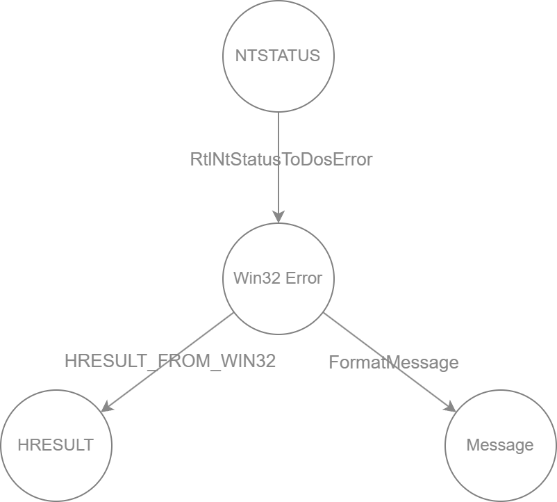

# wincodeman
Through this tool, you can quickly query the conversion values and error messages between NTSTATUS, Win32 Error and HRESULT.

Windows result/error code relationship:



## Usage

```
wcm.exe --help
wcm v0.1.0.078500ff
tool for query the windows error code information

USAGE:
    wcm.exe <--ntstatus <NTSTATUS>|--win32err <Win32Error>|--hresult <HRESULT>>

OPTIONS:
    -N, --ntstatus <NTSTATUS>      NTSTATUS code
    -E, --win32err <Win32Error>    Win32 error code
    -H, --hresult <HRESULT>        HRESULT error code
    -h, --help                     Print help information
    -v, --version                  Prints version information
```

## Example

TODO